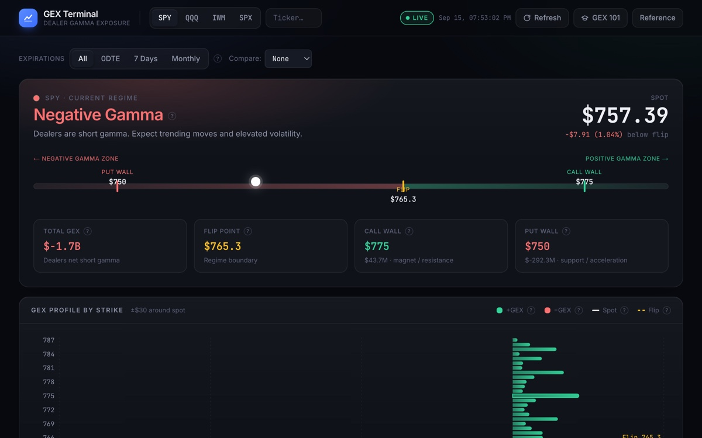

# GEX Terminal — Dealer Gamma Exposure

A live gamma exposure (GEX) terminal for index options. It pulls the full options chain from the Charles Schwab API, computes dealer gamma exposure per strike, and derives the market regime, flip point, and call/put walls — the levels where dealer hedging dampens or amplifies price. A Claude-powered panel writes a plain-English read of the profile and answers "what if" scenarios; daily snapshots enable historical comparison. A built-in **GEX 101** tutorial teaches the mechanics from delta and gamma up to a regime-aware playbook.



## Tech Stack

- **Backend:** Python 3.9+, FastAPI, Pandas, SQLite (snapshot history), Anthropic SDK
- **Frontend:** Next.js 16 (App Router), TypeScript, Tailwind CSS v4, Recharts
- **Data Source:** Charles Schwab API (OAuth 2.0) with a static sample fallback
- **Fonts:** JetBrains Mono (data) + Inter (UI)

## Quick Start

### Backend

```bash
cd backend
python3 -m venv .venv
source .venv/bin/activate
pip install -r requirements.txt
cp .env.example .env.local        # then fill in keys (see below)
uvicorn app.main:app --reload
```

The API runs on `http://localhost:8000`.

### Frontend

```bash
cd frontend
npm install
npm run dev
```

The dashboard runs on `http://localhost:3000`. First-time visitors get the GEX 101 tutorial automatically; reopen it any time from the **GEX 101** button.

### Run Tests

```bash
cd backend
source .venv/bin/activate
python -m pytest tests/ -v
```

## Live Data (Schwab)

1. Create an app at <https://developer.schwab.com> with callback URL `https://127.0.0.1` and put the app key/secret in `backend/.env.local`.
2. Run the OAuth flow — it opens the Schwab login, then asks you to paste the redirect URL you land on:

   ```bash
   cd backend && python -m app.auth_flow
   ```

   Tokens (and the issue timestamp) are written to `.env.local` and `DATA_SOURCE` is set to `schwab`. Restart the backend.

3. **Schwab refresh tokens expire after 7 days** — this is a hard Schwab limit. The top bar shows an amber pill when the token has under two days left and a red one once it has expired; the API returns `401` with re-auth instructions. Re-run step 2 to renew.

### Known data limitations

- **Index options (SPX, NDX, RUT) are not supported.** Schwab's chain endpoint reports `openInterest: 0` for every index contract, so GEX would be identically zero. The API refuses with a `422` and points to the ETF proxy (SPY, QQQ, IWM).
- Same-day contracts are dropped from the chain after the 4pm ET close (Schwab keeps them with stale greeks).
- Open interest is as of the prior close; greeks are Schwab's.

## Methodology

For each strike, `GEX = gamma × open interest × 100 × spot`, with calls counted positive and puts negative — the standard assumption that dealers are long calls and short puts. Values are dollars of dealer delta-hedging per $1 move in the underlying.

- **Flip point** — where cumulative GEX (scanned low→high) crosses zero. When the chain is net-negative and never crosses, the per-strike sign change nearest spot is used instead.
- **Regime** — positive when spot is above the flip point, negative below.
- **Call wall / put wall** — the strikes with the largest positive / negative net GEX.
- **Expiration filters** — `0dte` (nearest unexpired expiration), `weekly` (next 7 calendar days), `monthly` (nearest third-Friday expiration), `all`.

This is one analytical lens, not a signal. Nothing here is financial advice.

## Environment Variables

### Backend (`backend/.env.local`)

```env
DATA_SOURCE=sample          # "sample" or "schwab"
SCHWAB_APP_KEY=             # From developer.schwab.com
SCHWAB_APP_SECRET=          # From developer.schwab.com
SCHWAB_ACCESS_TOKEN=        # Written by `python -m app.auth_flow`
SCHWAB_REFRESH_TOKEN=       # Written by `python -m app.auth_flow`
SCHWAB_TOKEN_ISSUED_AT=     # Written by `python -m app.auth_flow`
ANTHROPIC_API_KEY=          # For the interpretation + scenario panels
```

### Frontend (`frontend/.env.local`)

```env
NEXT_PUBLIC_API_URL=http://localhost:8000
```

## API Endpoints

- `GET /api/health` — data source + Schwab token lifecycle (`state`, `expires_at`, `days_remaining`)
- `GET /api/gex/{symbol}?expiration_filter=all` — computed GEX profile (`0dte` | `weekly` | `monthly` | `all`)
- `POST /api/interpret` — plain-English market-structure analysis (Claude)
- `POST /api/scenario` — answer a "what if" question against the current profile (Claude)
- `POST /api/gex/{symbol}/snapshot` — save/refresh today's snapshot (live data only)
- `GET /api/gex/{symbol}/history` — available snapshot dates
- `GET /api/gex/{symbol}/history/{date}` — one saved snapshot
- `GET /api/gex/{symbol}/compare?date=YYYY-MM-DD` — current profile vs. a past snapshot

Error semantics: `401` Schwab re-auth needed · `422` symbol has no usable open interest · `502` upstream (Schwab / Anthropic) failure · `503` backend not configured.
